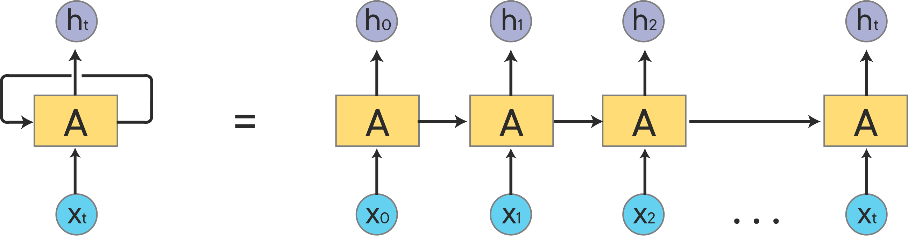

# Understanding Recurrent Neural Networks

## Introduction

In this lesson, you'll learn about a new type of model architecture you haven't seen yet&mdash;**_Recurrent Neural Networks_**!

## Objectives

You will be able to:

- Explain the role time steps play in RNN models 
- Explain back propagation through time 

## Data as Time Sequences

The hallmark of Recurrent Neural Networks is that they are used to evaluate **_Sequences_** of data, rather than just individual data points. So what is sequence data, and how do you distinguish it from other kinds of data, so that you know when to use an RNN? 

Time series data is a classic example of sequence data. You care about the value over time, and any given point in time can really only be examined relative to the other points of time in that sequence. For instance, knowing the price of Google stock today doesn't provide enough information for us to classify it as a something you should or shouldn't buy -- for that, you would need to examine today's price relative to the previous day(s) price to see if it's going up or down. 

Another great example of sequence data is text. All text data is sequence data by default -- a letter only makes sense when it's words are in the proper order. You would lose all information if you made a "Bag of Letters". Words themselves are sequence data, and can be used for all kinds of novel sequence generation tasks. You've probably seen articles in popular culture about people using neural networks to generate novel band names, cookie names, Pokemon names, etc. These are always done with Recurrent Neural Networks, because they are a perfect fit for sequence data. For this reason, RNNs excel at NLP tasks, because they can take in text as full sequences of words, from a single sentence up to an entire document or book! Because of this, they do not suffer the same loss of information that comes from a traditional Bag-of-Words vectorization approach. 

Let's take a look at the overall structure of an RNN to see how it interacts with this sequence data!

## Basic RNN Architecture

A basic Recurrent Neural Network is just a neural network that passes it's output from a given example back into itself as input for the next example. Intuitively, this approach makes sense. If you want to predict what Google's stock price is going to be two days from now, the most important input you can give it is what you think the price will be one day from now!

When drawn as a diagram, RNNs are usually represented in an **_Unrolled_** representation, which shows the components at each given timestep. The image on the left is a how an RNN is denoted in a diagram "rolled up", while the image on the right is "unrolled". The current timestep is denoted with the input node $X_t$, which makes the previous timestep $X_{t-1}$ and the next timestep $X_{t+1}$.  $H_0$ represents the model's output for timestep 0, which will then be passed back into the model in $X_1$. 

## Backpropagation Through Time

One interesting aspect of working with RNNs is that they use a modified form of back propagation called **_Back Propagation Through Time (BPTT)_**. Because the model is trained on sequence data, it has the potential to be right or wrong at every point in that sequence. This means that you need to adjust the model's weights at each time point to effectively learn from sequence data. Because the model starts at the most recent output, and then works backwards to calculate the loss and update the weights at each time step, the model is said to be going "back in time" to learn.  Since you have to update every single weight at every single time step, that means that BPTT is much more computationally expensive than traditional back propagation. For instance, if a single data point is a sequence with 1000 time steps, then the model will perform a full round of back propagation for each of the 1000 points in that single sequence. 

### Truncated Back Prop Through Time

This was a major hurdle for traditional RNN architectures, but a solution exists in the form of the **_Truncated Back Propagation Through Time (TBPTT)_** algorithm! We won't go deep into the specifics, but essentially, this algorithm increases performance by breaking a big sequence of 1000 points into 50 sequences of 20. This significantly improves training time over regular BPTT, but is still significantly slower than vanilla back propagation. 

Fun Fact: Truncated Back Prop Through Time was invented in the dissertation of Ilya Sutskever, one of the lead researchers at Open AI!

## Summary

In this lesson, you learned about the sequence data. You also learned about the architecture of RNNs, and the modified back prop algorithm they use for training!
